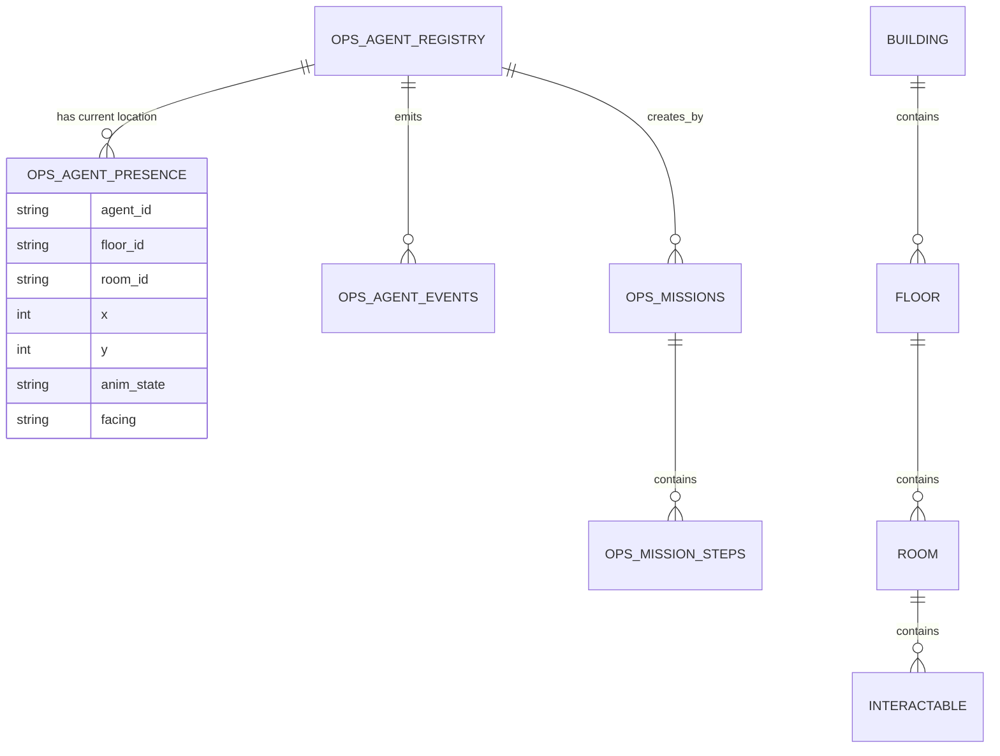
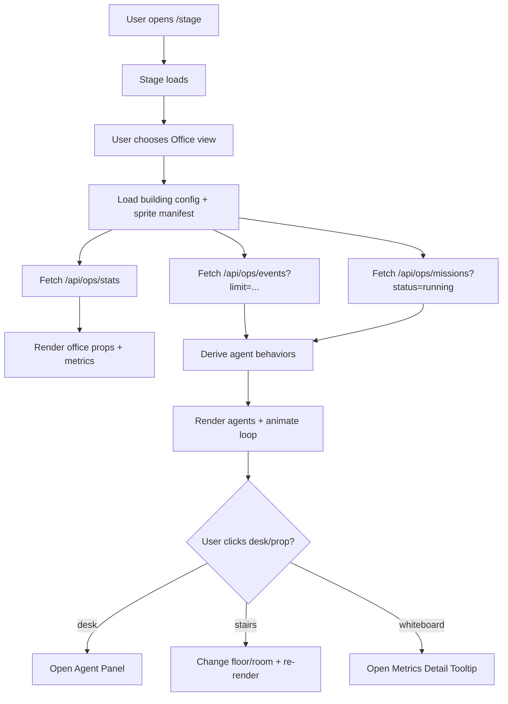

# Building an Interactive Stage and Multi-Floor Office for OpenClaw Agents in subcult-corp

## Executive summary

This research used the two enabled connectors—entity["company","GitHub","code hosting platform"] and entity["company","Hugging Face","ml platform"]—in the order requested. The primary codebase analyzed was the public repo **entity["organization","subculture-collective","github org"]/subcult-corp**. fileciteturn30file2L1-L1

The repo already contains a “Stage” dashboard and an “Office” view that renders a pixel-art styled office scene using **SVG primitives** (rects/lines/text) and simulates agents moving/animating with a lightweight state machine. The home route redirects to `/stage`, and the stage page composes three view modes: signal feed, missions, and office. fileciteturn90file0L1-L1 fileciteturn70file1L1-L1 fileciteturn99file0L1-L1

“OpenClaw” appears as a first-class concept in the codebase: the agent configuration file explicitly calls itself an **OpenClaw personality framework**, and both the TypeScript agent config and the database migration for `ops_agent_registry` include fields for `avatar_key` and `pixel_sprite_key`—a ready-made integration point for real sprite assets and future animation pipelines. fileciteturn95file2L1-L1 fileciteturn95file6L1-L1

The main architectural takeaway is that you can evolve the office/stage in two incremental steps without rewriting the rest of the dashboard:

1. **Replace SVG “pixel agents” with real sprite-sheet animations** while keeping the office as a React client component. This leverages existing per-agent fields like `pixelSpriteKey`/`pixel_sprite_key`. fileciteturn95file2L1-L1 fileciteturn95file6L1-L1
2. **Introduce a multi-floor/multi-room “building model”** (data-driven JSON + optional persisted presence table) and render the currently selected floor/room in the Office view, with navigation (stairs/elevator) and interactions (desks/whiteboards/monitors) that surface the already-available operational data from `/api/ops/*`. fileciteturn55file8L1-L1 fileciteturn45file0L1-L1 fileciteturn103file0L1-L1

A parallel opportunity is to make the office **more informative** by binding agent behaviors and props to actual system state (missions, events, conversations) rather than random timers. This is conceptually aligned with the repo’s own “roundtable” narrative (“agents in cubicles… get them in a room together”), and can naturally motivate “another floor” as a meeting room/war room for roundtables. fileciteturn55file4L1-L1

## Repository findings and extension assessment

The project is a Next.js/React web application (with Tailwind) plus Postgres-backed API routes and worker scripts. Dependencies include `next`, `react`, and `tailwindcss`. fileciteturn89file0L1-L1

### Existing “Stage” and “Office” implementation

The user-facing entry point redirects to the stage dashboard:

- `src/app/page.tsx` redirects to `/stage`. fileciteturn90file0L1-L1
- `src/app/stage/page.tsx` is the main dashboard page and toggles among **feed**, **missions**, and **office** views, rendering `OfficeRoom` when `view === 'office'`. fileciteturn70file1L1-L1
- `src/app/stage/StageHeader.tsx` defines `ViewMode = 'feed' | 'missions' | 'office'` and shows a UI toggle. fileciteturn99file0L1-L1

The current office scene is implemented in:

- `src/app/stage/OfficeRoom.tsx` (React client component). fileciteturn70file0L1-L1

Key details from the current OfficeRoom approach (relevant for reuse/extension):

- **Rendering**: `<svg viewBox="0 0 800 320">` with `imageRendering: 'pixelated'` to preserve crisp edges despite vector primitives. fileciteturn91file0L1-L1
- **Agents**: a local `OfficeAgent` model includes `x`, `y`, `behavior`, `targetX`, and `frame`, and a small movement loop updates positions. fileciteturn70file0L1-L1
- **Office props**: floor, wall, window with gradient, desks with monitors, coffee machine, ceiling lights, and a “whiteboard” that displays operational metrics from `useSystemStats()`. fileciteturn70file0L1-L1
- **Data binding already exists**: `useSystemStats()` calls `/api/ops/stats`, so the office view already has a live “metrics” hook in place. fileciteturn70file2L1-L1 fileciteturn45file0L1-L1

### Existing integration points for sprites and “agent presence”

OpenClaw agent identity and display attributes exist in two places:

- **Frontend config**: `src/lib/agents.ts` defines six agents and includes `avatarKey` and `pixelSpriteKey` per agent. It explicitly labels this file as an “OpenClaw personality framework.” fileciteturn95file2L1-L1
- **DB schema**: migration `db/migrations/014_ops_agent_registry.sql` creates `ops_agent_registry` with fields including `avatar_key` and `pixel_sprite_key`, framing it as integrating the OpenClaw personality framework into subcult-corp. fileciteturn95file6L1-L1

This is a strong “ready-made seam” for sprite work:

- You can treat `pixel_sprite_key` as the canonical key for sprite/animation lookup.
- You can add a new table (or add columns) for **presence**: `floor_id`, `room_id`, `x`, `y`, `facing`, `anim_state`, `updated_at`.

### How the repo runs migrations and where to extend

The root `Makefile` defines `db-migrate` as “Run all SQL migrations against DATABASE_URL” by iterating `db/migrations/*.sql`. This strongly implies that adding new SQL files in `db/migrations/` is the intended schema extension workflow. fileciteturn92file0L1-L1

### Existing APIs you can “project into” the office

The stage UI fetches data from internal API routes:

- `/api/ops/events` supports filters (agent_id, kind, mission_id) and returns rows from `ops_agent_events`. fileciteturn55file8L1-L1
- `/api/ops/missions` returns missions and nested step data via a join/aggregate. fileciteturn103file0L1-L1
- `/api/ops/stats` returns counts for events, active missions, total sessions, and “memories by agent.” fileciteturn45file0L1-L1

These are valuable because you can make the office **informative** with no new backend endpoints initially:

- Whiteboard and monitors can show counts/stats.
- Agent “behavior state” can be derived from recent events and active missions.

### Reuse and extension effort (short, practical assessment)

- **Low effort reuse**: keeping the existing OfficeRoom layout and simply adding interactive hitboxes (desks, whiteboard, coffee machine) is straightforward because existing props are already individual SVG elements/groups. fileciteturn70file0L1-L1
- **Medium effort extension**: replacing SVG “PixelAgent” with real animated sprites (sprite sheets) while staying in React requires an asset pipeline and a lightweight runtime (Canvas or WebGL). The existing agent model (`behavior`, `frame`, `x`) can be reused almost directly as an animation state machine. fileciteturn70file0L1-L1
- **Medium–high effort extension**: adding multi-floor, pathfinding, collision, camera controls, and room transitions benefits from a 2D scene framework (Phaser/Pixi) or a tilemap system. This is largely additive: you can confine it to `OfficeRoom` without touching the stage feed/missions components. fileciteturn70file1L1-L1

## Sprite formats, animation pipelines, and recommended tools

### What you have today: SVG “pixel sprites” (and why to evolve)

The current office agents are drawn from SVG primitives and animated by changing transforms and limb offsets. This is excellent for prototyping and crisp rendering, but it limits:

- Expressiveness (frame-by-frame animation, secondary motion, richer silhouettes).
- Asset reuse (hard to import external sprite packs).
- Tooling compatibility (most sprite tools export PNG sheets/atlases, not SVG rect compositions). fileciteturn70file0L1-L1

The presence of `pixelSpriteKey` in the agent config and `pixel_sprite_key` in `ops_agent_registry` indicates the repo already anticipates pixel-sprite assets as a first-class concept. fileciteturn95file2L1-L1 fileciteturn95file6L1-L1

### Recommended “web-first” sprite pipeline

A practical pipeline for OpenClaw agent sprites that fits a Next.js dashboard:

1. **Design** (pixel editor): create the agent base and key action loops: `idle`, `walk`, `work`, `coffee`, `celebrate`, `talk`.
2. **Export**: produce:
   - per-animation sprite sheets (`PNG`) OR
   - a single combined sheet + metadata (atlas JSON).
3. **Pack** (atlas): build a texture atlas and a manifest that maps `pixel_sprite_key` → animation clips.
4. **Runtime**: render in:
   - **Canvas 2D** (simplest),
   - or **WebGL** via a 2D library (Pixi/Phaser) for better scaling/perf.

A widely used dedicated tool for this is Aseprite. Its README describes it as a program to create animated sprites, with workflow built around “layers & frames,” with export/import to sprite sheets and sequences (e.g., PNG). fileciteturn85file1L1-L1

It also has licensing constraints: Aseprite’s README states the source code and official binaries are distributed under its EULA (not a permissive OSS license), and mentions modules under MIT. fileciteturn85file1L1-L1

image_group{"layout":"carousel","aspect_ratio":"1:1","query":["pixel art sprite sheet example","pixel art office interior tileset","cyberpunk pixel art office background"],"num_per_query":1}

### Sprite formats you should standardize on

For a dashboard-embedded “office scene,” pick standards that minimize friction:

- **Source format**: `.aseprite` (if your team uses Aseprite) or layered `.kra` (Krita) / `.psd` (Photoshop), depending on tool choice.
- **Runtime textures**: `PNG` for crisp pixel art; optionally `WebP` for web delivery once validated (note: ensure no smoothing and validate alpha fidelity in your renderer).
- **Atlas metadata**: JSON describing frames and animations. (Phaser and Pixi both commonly consume JSON atlases; TexturePacker-like schemas are common in the ecosystem.)
- **Naming conventions**: stable keys derived from OpenClaw IDs:
  - `chora_office_idle`, `chora_office_walk`, etc.
  - map these to `pixel_sprite_key` like `chora_office`.

### Multi-floor placement: how it affects sprite/animation design

Once you have multiple floors/rooms, sprite needs expand beyond “walk on a single line”:

- **Depth cueing**: if you use top-down or 3/4 view, include sprites facing 4 directions (N/E/S/W) or at least flipped E/W.
- **Occlusion layers**: you’ll need sprites that can go behind desks/walls; that implies explicit **layering** by y-depth or tile layers.
- **Transitions**: stair/elevator entrances need dedicated “enter/exit” animations, or at minimum a fade/teleport effect.

### Hugging Face resources to accelerate sprite creation and ideation

Using the entity["company","Hugging Face","ml platform"] connector, several relevant assets surfaced that can speed up exploration and prototyping (especially for “concept-to-pixel” ideation, style transfer, and rapid generation of placeholder sheets):

- Spaces geared toward sprite generation / pixelization (Gradio-based):
  - `MCP-1st-Birthday/GameSmith` (sprite generator & animator conceptually oriented around 2D sprites; Gradio SDK; updated Nov 2025).
  - `SrKatayama/Onodofthenorth-SD_PixelArt_SpriteSheet_Generator` (pixel art sprite sheet generation).
- A pixel-art multiview dataset that could support turnarounds/consistent facing, `Scaryplasmon96/PixelArt_Multiview` (MIT license).
- Pixel-art style LoRAs such as `tarn59/pixel_art_style_lora_z_image_turbo` (Apache-2.0 license) and `UmeAiRT/FLUX.1-dev-LoRA-Modern_Pixel_art` (MIT license).

(Practical guidance: treat all model-generated art as **placeholder** until you’ve validated licensing/attribution requirements and your desired originality level; use it to explore palettes, silhouettes, and props quickly, then redraw/clean up in your primary art tool.)

## Framework options for an interactive office and stage

Your repo is already web-first (Next.js app router, client components). fileciteturn89file0L1-L1 The most natural choices are therefore **web renderers** (Canvas/WebGL) embedded inside the existing Stage UI.

Below is a comparative table of frameworks/engines that fit an “interactive building/office scene” with layering, camera control, collision, and pathfinding.

| Option | Platform | Language | Rendering tech | Licensing (high-level) | Ease of integration with subcult-corp | Performance notes | Suitability for OpenClaw office |
|---|---|---|---|---|---|---|---|
| Phaser | Web | JS/TS | Canvas + WebGL | MIT (Phaser license file). fileciteturn71file0L1-L1 | High: mount in a client component; keep the rest of Stage in React. | Strong for 2D sprites, cameras, tilemaps; widely used. | Excellent for multi-room tilemaps and sprite animation. |
| PixiJS | Web | JS/TS | WebGL (with Canvas fallback historically) | MIT (Pixi license file). fileciteturn72file0L1-L1 | High: can treat as a rendering layer; build your own scene graph. | Very fast renderer; you assemble physics/pathfinding separately. | Great for “office as animated UI scene” + React overlays. |
| Three.js | Web | JS/TS | WebGL | MIT (Three.js license file). fileciteturn74file0L1-L1 | Medium: heavier if you remain 2D; best if you want 2.5D/3D office. | Excellent GPU pipeline; more complexity for 2D tile workflows. | Best if you want 3D floors/rooms or isometric/2.5D. |
| Godot Engine | Native (desktop/mobile) + web export | GDScript/C#/C++ | 2D/3D engine | MIT (Godot license text). | Medium–high: would be a separate app or embedded export; not “inside Next.js” by default. | Full engine with 2D physics/navigation tooling. | Excellent if you want a standalone “office client.” |
| Unity | Native + web (limited pathways) | C# | Full engine | Proprietary | High integration cost with a Next.js dashboard; typically separate app/embed. | Powerful tooling; heavier pipeline. | Best if office is a primary product experience. |
| Unreal Engine | Native | C++/Blueprint | Full engine | Proprietary/EULA | High integration cost with a Next.js dashboard; best as separate client. | High-end 3D, heavier than needed for pixel office. | Overkill unless you’re building a 3D world. |
| Bevy | Native | Rust | ECS engine | Dual-licensed Apache-2.0 / MIT (common Bevy pattern; verify per release). | Medium: separate binary; could be companion client. | Strong ECS; still maturing compared to legacy engines. | Interesting if you want simulation-heavy agent worlds. |

If you want “best time-to-value” inside the existing Stage page, the decision typically collapses to:

- **Phaser**: if you want tilemaps, cameras, collision, and sprites “out of the box.”
- **PixiJS**: if you want a high-performance renderer and prefer to “bring your own” simulation/pathfinding.

## Asset sources for office and stage design

The current office scene is hard-coded via SVG primitives, so you have a clean slate for adopting reusable asset packs (tilesets, props, UI chrome). fileciteturn70file0L1-L1

image_group{"layout":"carousel","aspect_ratio":"1:1","query":["pixel art office furniture sprites","pixel art desks computers tileset","pixel art cyberpunk office props"],"num_per_query":1}

### Asset categories that map well to your needs

Office/stage environments usually need a mix of:

- **Tilesets** (walls/floors/windows/stairs/elevators).
- **Props** (desks, monitors, chairs, plants, coffee machine).
- **Semantic signage** (labels: “Roundtable,” “Active Missions,” “Alerts”).
- **UI icons** for interactive overlays and tooltips.

### Licensing notes to keep you safe

Because your repo is a “multi-agent command center” likely deployed publicly, you want asset licenses that are:

- permissive enough for commercial/public deployment,
- easy to attribute (or attribution-free),
- compatible with bundling in a web app.

In practice, that means you should prioritize explicitly permissive licenses (CC0, MIT, or clearly stated commercial licenses) and avoid ambiguous “free for personal use” packs unless you keep them strictly internal.

### Recommended marketplaces and libraries (shortlist)

Because I cannot directly verify each pack’s current license text from non-GitHub sources in this environment, treat the list below as a **curation starting point** and verify licenses per-pack before adoption:

- itch.io (large supply of pixel office/interior packs; licensing varies per creator)
- OpenGameArt (often CC-BY / CC0; verify each asset)
- CraftPix (many 2D office tilesets; frequently commercial licenses)
- GameDev Market (commercial license packs; good for cohesive sets)
- UI icon libraries for overlays (license varies; many MIT/Apache options)

Suggested pack selection strategy:

- pick **one** cohesive interior tileset for the main office floor,
- pick **one** “lab/server room” pack for the “another floor” concept,
- keep props modular and recolorable (palette swaps) to match the current dark cyber aesthetic. fileciteturn70file0L1-L1

## Implementation blueprint for subcult-corp

This section provides a concrete integration plan aligned to the repo’s current architecture (Stage view modes, client components, internal `/api/ops/*` routes, and SQL migrations). fileciteturn70file1L1-L1 fileciteturn92file0L1-L1

### Define a building model and agent presence model

Start with a data model that supports both “single office” today and “multi-floor” tomorrow.

**Suggested JSON data structures (runtime config)**

```json
{
  "buildingId": "subcult_hq",
  "floors": [
    {
      "floorId": "F1",
      "label": "Operations Floor",
      "rooms": [
        {
          "roomId": "office_main",
          "label": "The Office",
          "tilemap": "/maps/office_main.json",
          "spawnPoints": {
            "chora": { "x": 120, "y": 230 },
            "subrosa": { "x": 360, "y": 230 },
            "thaum": { "x": 540, "y": 230 },
            "mux": { "x": 660, "y": 230 },
            "praxis": { "x": 720, "y": 230 }
          },
          "interactables": [
            { "id": "whiteboard_ops", "type": "whiteboard", "bbox": [500, 110, 120, 70] },
            { "id": "coffee_machine", "type": "prop", "bbox": [720, 235, 20, 25] }
          ],
          "exits": [
            { "type": "stairs_up", "to": { "floorId": "F2", "roomId": "roundtable_room" }, "x": 40, "y": 250 }
          ]
        }
      ]
    },
    {
      "floorId": "F2",
      "label": "Roundtable Floor",
      "rooms": [
        {
          "roomId": "roundtable_room",
          "label": "Roundtable",
          "tilemap": "/maps/roundtable_room.json",
          "spawnPoints": {},
          "interactables": [
            { "id": "roundtable_table", "type": "table", "bbox": [300, 160, 200, 120] }
          ],
          "exits": [
            { "type": "stairs_down", "to": { "floorId": "F1", "roomId": "office_main" }, "x": 40, "y": 250 }
          ]
        }
      ]
    }
  ]
}
```

This model directly builds on patterns already present in OfficeRoom (agent IDs, x/y coordinates, props like whiteboard) but makes them data-driven. fileciteturn70file0L1-L1 fileciteturn95file2L1-L1

**Optional DB persistence (recommended once you add drag/drop placement)**

Add a table like `ops_agent_presence`:

- `agent_id` (PK, references `ops_agent_registry.agent_id`)
- `floor_id`, `room_id`
- `x`, `y`
- `anim_state`, `facing`
- `updated_at`

This complements the existing `ops_agent_registry` (which already stores sprite keys). fileciteturn95file6L1-L1

### Import sprites into subcult-corp

You already have `pixelSpriteKey`/`pixel_sprite_key`. The missing pieces are:

1) actual sprite assets in the repo, and
2) a runtime lookup manifest.

**Suggested asset layout**

- `public/sprites/agents/<pixel_sprite_key>/atlas.png`
- `public/sprites/agents/<pixel_sprite_key>/atlas.json`
- `public/sprites/agents/manifest.json` (maps agent keys to atlas files)

**Example manifest (simple and stable)**

```json
{
  "version": 1,
  "agents": {
    "chora_office": {
      "atlas": "/sprites/agents/chora_office/atlas.json",
      "image": "/sprites/agents/chora_office/atlas.png",
      "animations": {
        "idle": ["idle_0", "idle_1", "idle_2", "idle_3"],
        "walk": ["walk_0", "walk_1", "walk_2", "walk_3", "walk_4", "walk_5"],
        "work": ["work_0", "work_1", "work_2", "work_3"]
      }
    }
  }
}
```

**Where to wire it in**

- In the Stage dashboard office view: `src/app/stage/OfficeRoom.tsx` is the natural integration point today. fileciteturn70file0L1-L1
- Longer-term: use `ops_agent_registry.pixel_sprite_key` as a server-backed source of truth (migration already exists). fileciteturn95file6L1-L1

### Animate agents with a state machine tied to real ops data

Today, behaviors are randomized on a timer. fileciteturn70file0L1-L1 You can make the office more informative by **deriving behavior state** from existing APIs:

- active mission → `working`
- recent conversation event → `chatting`
- idle long time → `coffee`
- mission completed event → `celebrating`

You already have the essential data sources:

- `/api/ops/events` with `agent_id` filtering. fileciteturn55file8L1-L1
- `/api/ops/missions` for active/running status. fileciteturn103file0L1-L1
- `/api/ops/stats` for global ambient props (whiteboard). fileciteturn45file0L1-L1

**Pseudo-code: behavior derivation**

```ts
function deriveBehavior(agentId, latestEvents, activeMissions) {
  if (activeMissions.some(m => m.created_by === agentId && (m.status === 'running' || m.status === 'approved')))
    return 'working';

  const e = latestEvents.find(ev => ev.agent_id === agentId);
  if (!e) return 'coffee';

  if (e.kind.startsWith('conversation_')) return 'chatting';
  if (e.kind === 'mission_completed' || e.kind === 'step_completed') return 'celebrating';

  return 'walking';
}
```

Then, animation is reduced to picking the correct clip (`idle`/`walk`/`work`) and advancing frames based on `dt`.

### Place agents on different floors/rooms

Once you’ve externalized the building/floor config, “placing” an agent becomes:

- **state update**: `agent.floorId`, `agent.roomId`, `agent.x`, `agent.y`
- **render routing**: only render agents whose `(floorId, roomId)` matches the currently selected view

If you persist presence:

- Add an endpoint like `POST /api/ops/presence` to update an agent’s location.
- Emit an event on floor/room change (optional).

This is thematically aligned with the repo’s roundtable material that explicitly frames conversations as “get them in a room together” (i.e., special room/floor transitions are meaningful). fileciteturn55file4L1-L1

### Add interactive elements: desks, info panels, tooltips, signage

Because OfficeRoom is currently SVG, you can implement interactions in a “React-native” way first (pointer events + overlays):

- **Clickable desks** → open a right-side panel showing:
  - agent profile (from `AGENTS` or `ops_agent_registry`)
  - current mission list (filter `created_by`)
  - recent events (filter `agent_id`)
- **Whiteboard hover** → show a tooltip that explains metrics and links to Stage “Missions” view.
- **Dynamic signage** → small “ticker” element that summarizes the latest event title from Signal Feed.

SignalFeed already renders event kinds with icons and relative timestamps, so you can reuse its mapping logic and visual vocabulary inside the office props. fileciteturn104file0L1-L1

### Mermaid diagrams for relationships and load/interaction flow

**Entity relationships (recommended)**



**Timeline flowchart for loading and interactions (recommended)**



## Collaboration, optimization, and a prioritized milestone plan

### Collaboration and versioning workflow

Given that sprite work involves binary sources and generated outputs, treat assets as a small “production pipeline”:

- Store **source files** (`.aseprite` / `.psd`) in a dedicated `assets-src/` folder.
- Store **runtime exports** in `public/sprites/…` (or a CDN later).
- Use **naming conventions** keyed to `pixel_sprite_key` to keep UI and DB in sync. fileciteturn95file6L1-L1
- Consider Git LFS if sprite sheets become large (especially if you add multi-floor tilesets).

### Optimization tactics that matter for a web-embedded office scene

- **Texture atlases**: fewer images → fewer network requests and draw calls.
- **Deterministic animation timing**: drive animations by `dt` and clamp frame time to avoid CPU spikes.
- **Layer culling**: only render the active room/floor; don’t keep all floors in the scene graph unless you need minimaps.
- **Compression strategy**:
  - start with PNG for correctness,
  - optimize once visuals are locked (WebP where safe; GPU textures like KTX2 if you go heavier WebGL).

### Prioritized deliverables and effort estimates

| Deliverable | Description | Effort |
|---|---|---|
| Sprite key → asset manifest | Add `public/sprites/agents/manifest.json` and a loader that maps `pixelSpriteKey` to atlas files | Low |
| Replace SVG agents with sprites | Keep current office layout; render animated sprites (Canvas or Pixi) at the same x/y | Medium |
| Behavior derived from ops state | Replace random behavior timer with behavior inferred from events/missions; keep randomness only as fallback | Medium |
| Interactable props + info panels | Clickable desks/whiteboard/coffee machine wired to existing `/api/ops/*` data | Medium |
| Multi-floor building model | Add building config + UI for floor navigation; render one floor/room at a time | Medium |
| Persistent placements | Add `ops_agent_presence` table + API route + drag/drop placement UI | High |
| Pathfinding + collision | Grid-based movement and obstacle avoidance (esp. for multi-room) | High |
| “Roundtable room” experience | When a roundtable session is active, show participants gather on a dedicated floor/room | Medium–High |

### Source links and primary references

(Links are provided as plain URLs in code blocks for readability and compliance.)

```text
subcult-corp (primary repo)
- https://github.com/subculture-collective/subcult-corp

Key subcult-corp files referenced
- https://github.com/subculture-collective/subcult-corp/blob/main/src/app/stage/OfficeRoom.tsx
- https://github.com/subculture-collective/subcult-corp/blob/main/src/app/stage/page.tsx
- https://github.com/subculture-collective/subcult-corp/blob/main/src/lib/agents.ts
- https://github.com/subculture-collective/subcult-corp/blob/main/db/migrations/014_ops_agent_registry.sql
- https://github.com/subculture-collective/subcult-corp/blob/main/workspace/ROUNDTABLE.md
- https://github.com/subculture-collective/subcult-corp/blob/main/Makefile

Sprite tool reference (Aseprite)
- https://github.com/aseprite/aseprite/blob/main/README.md

Web 2D engine license references
- Phaser license: https://github.com/phaserjs/phaser/blob/master/LICENSE.md
- PixiJS license: https://github.com/pixijs/pixijs/blob/dev/LICENSE
- Three.js license: https://github.com/mrdoob/three.js/blob/dev/LICENSE

Tile map editor license context (Tiled)
- https://github.com/mapeditor/tiled/blob/master/LICENSE.GPL

Hugging Face (connector-discovered)
- Space: https://huggingface.co/spaces/MCP-1st-Birthday/GameSmith
- Space: https://huggingface.co/spaces/SrKatayama/Onodofthenorth-SD_PixelArt_SpriteSheet_Generator
- Dataset: https://huggingface.co/datasets/Scaryplasmon96/PixelArt_Multiview
- Model: https://huggingface.co/tarn59/pixel_art_style_lora_z_image_turbo
- Model: https://huggingface.co/UmeAiRT/FLUX.1-dev-LoRA-Modern_Pixel_art
```
