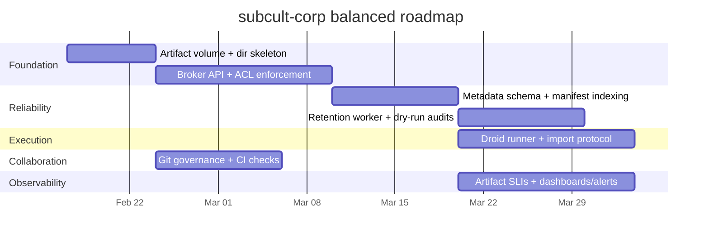

# Multi-Agent Production Workflow, Collaborative Workspace, and Docker-Based Output Filing System for subcult-corp

## Executive summary

The current subcult-corp repository in entity["organization","subculture-collective","github org"] already contains a substantial foundation for a “living office” multi-agent system: a Docker-Compose stack, a Next.js app, multiple workers, a database-backed ops/heartbeat loop, a defined roster of six agents (primus/mux/chora/thaum/subrosa/praxis), and a “workspace” concept with coordination doctrine and agent identity/soul files. fileciteturn48file2L1-L1 fileciteturn96file1L1-L1 fileciteturn49file0L1-L1 fileciteturn100file0L1-L1 fileciteturn61file8L1-L1

What’s missing for “production workflow + collaborative workspace + Docker-based filing” is not a new orchestration concept; it’s a **formal artifact system**: stable directories, explicit access rules, lifecycle/retention, provenance metadata, and a ship pipeline that reliably turns multi-agent activity (meetings, research, synthesis, integration) into **auditable outputs** (reports, PRs, release bundles) without polluting the repo with volatile logs. The repo currently includes cron job configs and JSONL run logs under `workspace/cron/…` and even an OpenRouter usage export committed at repo root, signaling a need for a clearer boundary between **durable deliverables** vs **ephemeral telemetry**. fileciteturn103file14L1-L1 fileciteturn105file0L1-L1 fileciteturn103file13L1-L1

This report recommends a **Balanced** proposal: add a Docker-mounted `/data` artifact volume with a standardized directory layout; implement a small “artifact broker” (a service/skill) that enforces agent-scoped permissions and writes provenance manifests; adopt Git-based collaboration via branch protection + CODEOWNERS + required checks; and formalize droid/sub-agent spawning as resource-limited, isolated tasks whose outputs must be “checked in” through the broker before shipping. It preserves your existing architecture and agent ethos, but makes outputs dependable, discoverable, and governable.

## Current repo artifacts and operational gaps

### What already exists and how it works now

The Docker runtime is already structured as a multi-service system: the composition file defines an app, workers, a Postgres database, and an “openclaw-bridge” service that mounts host directories (e.g., `~/.openclaw/…`) into a container and pushes events into the database. fileciteturn96file1L1-L1 This implies a split between (a) the subcult-corp application stack and (b) an external agent runtime/telemetry system (“OpenClaw”) whose filesystem is treated as an input stream.

The container build (Dockerfile) uses a multi-stage Next.js build and copies `workspace/` into the runtime image alongside the app, indicating that “workspace” is presently a **repo-tracked** configuration bundle rather than a mounted, write-heavy runtime volume. fileciteturn97file1L1-L1

The application has a periodic heartbeat endpoint that performs trigger evaluation, reaction processing, stale-step recovery, roundtable scheduling, outcome learning, and initiative queueing—then writes audit results into ops tables. fileciteturn48file0L1-L1 This is already an internal control plane you can extend for “artifact production guarantees” (e.g., ensure that for every report request, a file artifact exists or a failure is raised).

A “living office” meeting system is codified in code as conversation formats (standup, triage, deep_dive, shipping, etc.) and a probabilistic daily schedule that picks which discussants meet at which hour. fileciteturn99file0L1-L1 fileciteturn98file0L1-L1 The six-agent roster is defined and used by schedule/roundtable. fileciteturn100file0L1-L1

The agent roles are also explicitly defined in “identity” and “soul” documents for primus, mux, chora, thaum, subrosa, praxis—plus an inter-agent coordination doctrine describing sequencing and veto dynamics. fileciteturn61file5L1-L1 fileciteturn61file0L1-L1 fileciteturn61file7L1-L1 fileciteturn61file1L1-L1 fileciteturn61file3L1-L1 fileciteturn61file6L1-L1 fileciteturn61file8L1-L1

Finally, there is a “skills registry,” including a “coding-agent” skill that suggests running external coding agents (Codex CLI, Claude Code, OpenCode) as background processes—this is the seed for a formal “droid” spawning model, but without strong isolation rules and output capture it becomes a security and governance risk. fileciteturn100file3L1-L1

### Gaps that block a production-grade output workflow

The repo contains **volatile runtime artifacts committed as source**: multiple cron job backups, JSONL run logs, and a usage/cost export CSV. This indicates the system is already producing operational traces, but without retention policies or a clean separation between: (a) ephemeral telemetry, (b) intermediate artifacts, and (c) publishable deliverables. fileciteturn105file0L1-L1 fileciteturn105file1L1-L1 fileciteturn103file13L1-L1

The “workspace” doctrine references a broader directory universe (e.g., memory files, costs/security reporting, etc.) but the repo-tracked `workspace/` is currently acting as both **configuration** and **artifact storage**, creating ambiguity about what should be versioned under Git versus stored in a Docker volume with retention/rotation. fileciteturn103file6L1-L1

The Compose stack’s dependency on host paths (`/home/onnwee/.openclaw/...`) reduces portability and makes it harder to standardize output locations across deployments (local dev vs server vs CI). fileciteturn96file1L1-L1

On the collaboration side, the repo contains lint/build scripts but no clearly established CI/CD governance for “agent-produced code” (e.g., enforced checks, CODEOWNERS, protected branches), which you will need if you want autonomous or semi-autonomous PR generation to scale beyond one human maintainer. fileciteturn51file0L1-L1

## Recommended Docker file structure for outputs, personal spaces, and shared workspace

### Design principle: a three-tier artifact boundary

The central recommendation is to separate three categories of state:

**Repo-tracked configuration and templates (`/app/workspace_spec`)**  
Stable: agent identity/soul docs, format/schedule specs, operational templates, schemas, “what good looks like,” and integration policies. This remains in Git.

**Runtime workspace (`/data`)**  
Writable: per-agent personal areas, shared scratch, runs/logs, caches, and intermediate artifacts. This is a Docker volume (or bind mount) and is *not* committed.

**Shippable deliverables (`/data/outputs` → promoted to Git)**  
Curated: reports, release notes, PR bundles, final datasets. They are produced in `/data/outputs`, then either:
- committed to the repo under a `deliverables/` directory (recommended for “final outputs”), or
- attached/published externally (not assumed here), with only manifests committed.

This mirrors common container security guidance: keep the application image stable and mount writable data separately; limit what processes can modify. Docker’s documentation on user namespace remapping and rootless mode supports the broader idea of “reduce privileges + isolate mutable state.” fileciteturn75file1L1-L1 fileciteturn93file2L1-L1

### Concrete container directory layout

Inside all containers that participate in production workflows (app, workers, droid-runner), standardize on:

- `/app` – read-only runtime application code (the image)
- `/data` – the mounted volume for mutable state
- `/tmp` – ephemeral, cleared on container restart (optionally tmpfs)

Proposed `/data` tree:

```text
/data
  /workspace
    /shared
      /inbox                # inbound requests, meeting notes, raw uploads (sanitized)
      /scratch              # shared scratchpad; always safe to delete
      /reference            # canonical refs: policies, schemas, glossaries
      /integration          # staging area for “ready to ship” bundles
    /personal
      /chora
      /subrosa
      /thaum
      /praxis
      /mux
      /primus               # mostly directives; rarely written
    /sessions
      /roundtable           # transcripts + metadata
      /missions             # task graphs, step outputs
      /droids               # per-droid working dirs (ephemeral by policy)
    /state
      /locks                # mutexes, lease files
      /indexes              # artifact indexes, last-run pointers
      /queues               # spool files if DB unavailable
    /logs
      /app
      /workers
      /droids
      /cron
    /cache
      /web                  # cached fetches / snapshots
      /llm                  # prompt+response caches (if allowed)
  /outputs
    /reports
    /releases
    /datasets
    /manifests
  /retention
    retention.yml           # retention policy config (authored in repo, copied here)
```

This is directly responsive to what your repo already demonstrates: cron job configs and JSONL run traces currently live under `workspace/cron/…`, and cost usage exports exist as ad hoc files. This layout provides an explicit home for those outputs under `/data/workspace/logs/cron` and `/data/workspace/shared/reference` or `/data/outputs/manifests`. fileciteturn103file14L1-L1 fileciteturn103file13L1-L1

### Docker Compose changes implied by the layout

Minimal changes required:

- Add a named volume `subcult_data:` and mount it at `/data` for all services that write outputs (app + workers + droid-runner).
- Keep `/app` (the code) untouched; do **not** bind-mount the repo over `/app` in production (dev can still do so).
- Replace host-specific OpenClaw mounts with a configurable bind mount (e.g., `OPENCLAW_HOME`) or treat OpenClaw as an upstream “ingest” pipeline into `/data/workspace/shared/inbox`.

This increases portability and de-risks accidental commits of runtime logs.

## File naming, metadata, versioning, and retention policies

### Naming scheme: deterministic, sortable, human-legible

A production filing system needs filenames that are:
- chronological,
- globally unique,
- attributable to an agent and workflow stage,
- stable under repeated runs.

Recommended filename convention:

`YYYY-MM-DD__<workflow>__<artifact-type>__<slug>__<agent>__v<nn>.<ext>`

Examples:
- `2026-02-13__research__brief__docker-artifact-broker__chora__v01.md`
- `2026-02-13__ship__release-notes__subcult-corp-0.2.0__mux__v03.md`
- `2026-02-13__audit__risk-review__tweet-wave__subrosa__v01.md`

The version suffix is intentionally simple for human handling; the *real* identity of the artifact is in metadata.

### Metadata: front matter + manifest index

Every human-readable deliverable (Markdown) should include YAML front matter (or TOML) with at least:

- `artifact_id` (UUIDv7 recommended; lexicographically sortable)
- `created_at` (RFC3339)
- `agent_id` (one of the six)
- `workflow_stage` (meeting/research/synthesize/integrate/report/ship)
- `source_refs` (pointers to transcripts, PRs, issues, datasets)
- `sensitivity` (public/internal/restricted)
- `retention_class` (ephemeral/standard/record)
- `status` (draft/final/shipped)
- `hash` (sha256 of body or full file)

In addition, maintain a machine-readable manifest file per output directory:

- `/data/outputs/manifests/index.jsonl` (append-only, one line per artifact)
- optional `/data/outputs/manifests/<artifact_id>.json` (full metadata)

This makes it possible to enforce “outputs are produced,” independently of Git, by checking manifest writes.

### Versioning model: Git for curated outputs, content-hash for runtime artifacts

- **Curated deliverables** (final reports, release notes, canonical docs) should be committed to Git to leverage diff, review, and provenance. This aligns with establishing branch protections and code ownership controls in entity["company","GitHub","code hosting platform"]. fileciteturn77file0L1-L1 fileciteturn76file2L1-L1
- **Runtime artifacts** (logs, intermediate JSON, cached pages, droid scratch) should not be committed. They should be indexed by `artifact_id` and content hash, and governed by retention.

### Retention policy: explicit, automated, and safe-by-default

Define retention classes:

- **ephemeral**: delete after 7 days (droid scratch, raw web snapshots, transient logs)
- **standard**: keep 30–90 days (roundtable transcripts, mission step outputs, cron logs)
- **record**: keep indefinitely (final reports, security decisions, shipped manifests)

The repo already shows failure modes like repeated cron delivery errors and rate-limiting traces in run logs; those are valuable for debugging but should be rotated and archived, not committed forever. fileciteturn105file1L1-L1 fileciteturn105file0L1-L1

Operationally:
- Add a daily “retention worker” that:
  1. scans `/data/workspace/logs`, `/data/workspace/sessions`, `/data/workspace/cache`;
  2. applies rules from `retention.yml`;
  3. compresses eligible logs (e.g., `.jsonl` → `.jsonl.gz`);
  4. deletes expired items;
  5. writes a retention report under `/data/outputs/reports/…`.

## Agent roles, permissions model, and droid spawning lifecycle

### Core roles (as currently defined) and what they imply for file authority

The repo’s identity/soul documents are not just “flavor”; they embed a governance model:

- Primus: rare, sovereignty/mandate/strategic red lines. fileciteturn61file5L1-L1
- Mux: operational execution, formatting, packaging, moving artifacts. fileciteturn61file0L1-L1
- Chora: legibility, analysis, research, systems explanation. fileciteturn61file7L1-L1
- Thaum: reframing, unblocking, bounded novelty. fileciteturn61file1L1-L1
- Subrosa: risk assessment, controlling exposure, veto. fileciteturn61file3L1-L1
- Praxis: decisions, commitment, follow-through. fileciteturn61file6L1-L1

Your `INTERWORKINGS.md` also describes sequencing (clarify → protect → reframe → commit → execute) and makes “veto” and “handoff” central. fileciteturn61file8L1-L1

A filing system should **encode** this: not all agents should be able to write everywhere, and “shipping” should require explicit handoffs.

### Permissions model: broker-enforced ACLs, not “best effort” conventions

Linux file permissions inside a container won’t reliably govern LLM-driven tools, because the real authority is *the skill/tool interface*. The recommended model is:

1. Implement a single “artifact broker” service (or skill) with API:
   - `create_artifact(metadata, path_hint, content|bytes)`
   - `append_artifact(artifact_id, content_delta)`
   - `promote_artifact(artifact_id, new_status)`
   - `publish_artifact(artifact_id, target=git|release_bundle)`
2. The broker enforces ACLs based on `agent_id` and `retention_class`.
3. All agents write through the broker; direct filesystem writes are limited to droid scratch and caches.

A practical directory ACL matrix:

| Area | Write allowed | Notes |
|---|---|---|
| `/data/workspace/personal/<agent>/…` | **that agent only** | Personal drafting, scratch, partial notes |
| `/data/workspace/shared/inbox/…` | chora, praxis, mux | Intake only; no “finals” here |
| `/data/workspace/shared/integration/…` | mux (primary), praxis (secondary) | “Ready-to-ship” staging |
| `/data/outputs/reports/…` | mux, chora | mux finalizes, chora authors |
| `/data/outputs/releases/…` | mux, praxis | mux packages, praxis approves |
| `/data/outputs/manifests/…` | broker-only | provenance integrity |
| `/data/workspace/logs/…` | system/workers only | agents cannot edit logs |

This matches the intent of the roles: mux executes packaging; praxis commits; subrosa vetoes; thaum reframes but doesn’t ship. fileciteturn61file8L1-L1

### Droid / sub-agent spawning model

Your system already hints at dispatching external coding agents as background processes. fileciteturn100file3L1-L1 To make this safe and reliable, formalize “droids” as:

**Definition**  
A droid is an ephemeral worker instance (process or container) spawned by one of the six agents to perform a bounded task (research, code change, test run, packaging) and emit outputs into a single designated directory.

**Lifecycle**
1. **Spawn request**: parent agent submits `droid_spec` to a queue (DB table or `/data/workspace/state/queues` spool).
2. **Provision**: droid-runner allocates:
   - `droid_id` (UUID)
   - working directory: `/data/workspace/sessions/droids/<droid_id>/`
   - input snapshot (optional): read-only bind mount of needed repo subset or artifact refs
3. **Execution**: droid runs with:
   - strict time limit (e.g., 5–30 minutes)
   - bounded CPU/memory
   - restricted network by default (only allow if needed)
4. **Output sealing**: droid writes outputs to its working directory + a `droid_result.json`.
5. **Import**: parent agent must explicitly “check in” outputs via artifact broker (promote from droid scratch → workspace/shared or outputs).
6. **Termination**: droid directory is either deleted (ephemeral class) or archived/compressed (standard class).

**Resource limits and isolation**
Use container-level hardening patterns (rootless where feasible; user namespace remapping; reduce privileges) as documented in Docker’s official manuals. fileciteturn93file2L1-L1 fileciteturn75file1L1-L1

For higher-assurance security guidance, map the “least privilege + reduced attack surface” approach to NIST container security recommendations (SP 800-190 is the canonical reference point, even if you apply only a subset). fileciteturn88file0L1-L1

**Security boundary rules**
- Droids cannot write into `/data/outputs` directly.
- Droids cannot modify `/app` (repo code) directly; code changes must be staged as patches and then applied by a governed “code integration” step.
- Droids cannot access secrets unless explicitly granted for a single job.

This structure also aligns with “agentic software engineering” systems that separate (a) reasoning/coordination from (b) controlled tool execution, as discussed in SWE-agent’s background materials and approach to agent-computer interfaces. fileciteturn84file1L1-L1

## Workflow steps from meetings to ship, plus collaboration and observability

### Canonical production workflow: meeting → research → synthesize → integrate → report → ship

The repo already has meeting primitives (formats + schedule) and an ops heartbeat for periodic orchestration. fileciteturn99file0L1-L1 fileciteturn48file0L1-L1 The recommended production workflow overlays a deterministic artifact pipeline on top:

**Meetings (Roundtable sessions)**
- Trigger: schedule slot fires or a human/request is added to `/data/workspace/shared/inbox`.
- Output: transcript + meeting summary artifact:
  - transcript path: `/data/workspace/sessions/roundtable/<session_id>/transcript.jsonl`
  - summary path: `/data/outputs/reports/YYYY-MM-DD__meeting-summary__<topic>__mux__v01.md`

**Research**
- Owner: chora (primary), thaum optional for reframing, subrosa optional for risk constraints.
- Outputs:
  - research briefs in `/data/workspace/personal/chora/…`
  - curated research packet promoted to `/data/workspace/shared/reference/…`

**Synthesize**
- Owner: chora synthesizes; thaum may generate alternate frames; subrosa validates exposure risks.
- Output: a synthesis memo artifact, tagged with evidence pointers.

**Integrate**
- Owner: mux packages; praxis chooses; subrosa reviews risks; primus invoked only if strategic conflict arises.
- Output: integrated bundle in `/data/workspace/shared/integration/<bundle_id>/…` containing:
  - decision record
  - patch set (if code)
  - report draft
  - release checklist

**Report**
- Owner: mux produces final deliverable; chora may author narrative sections; subrosa signs off on public-facing exposure.
- Output: final report in `/data/outputs/reports/…` with manifest entry.

**Ship**
- Owner: praxis signs; mux executes ship action.
- Outputs:
  - if code: PR opened, checks run, approvals required, merge performed under policy
  - if docs/report: commit deliverable to repo or export bundle

This maps naturally onto your existing role sequencing doctrine. fileciteturn61file8L1-L1

### Collaborative editing and CI/CD for agent-produced app code

To safely integrate agent-produced code, use a protected-branch + PR-based model. Official documentation emphasizes that CODEOWNERS can be used to require reviews from designated owners, and branch protection rules can require status checks and reviews before merging. fileciteturn76file2L1-L1 fileciteturn77file0L1-L1 fileciteturn77file1L1-L1

Recommended governance controls:

- Add `.github/CODEOWNERS` to encode review requirements:
  - `/src/lib/skills/**` → subrosa + praxis (security/tooling)
  - `/src/lib/ops/**` → praxis
  - `/workspace/**` → chora + mux
  - `/db/migrations/**` → praxis + subrosa
- Protect `main` with:
  - required status checks (`lint`, `typecheck`, `build`)
  - required reviews (at least one; add “security review required” for sensitive areas)
  - disallow direct pushes
- Implement a “bot PR” convention:
  - branch naming: `agent/<agent_id>/<slug>`
  - PR template requires: intent summary, risk notes, test evidence, and artifact manifest link.

Even if you use external coding agents (as your skills registry anticipates), the merge gate stays the same: agent output is a proposal until it passes checks + review. fileciteturn100file3L1-L1

### Metrics and observability: ensuring outputs are actually produced

Your system already logs heartbeat actions into ops tables. fileciteturn48file0L1-L1 Expand this with an artifact-focused observability layer:

**Minimum viable metrics**
- `artifacts_created_total{type,agent,stage}`
- `artifacts_promoted_total{from_status,to_status}`
- `artifact_pipeline_latency_seconds{stage}` (time from meeting → ship)
- `droids_spawned_total{purpose,agent}`
- `droid_failures_total{reason}`

**Operational SLIs (service-level indicators)**
- “Output freshness”: time since last `report` artifact of each class
- “Queue health”: count of pending mission steps / droid jobs
- “Ship rate”: shipped artifacts per week
- “Stall rate”: artifacts that remain “draft” beyond X days

Using OpenTelemetry as the common format for stability and evolution of telemetry schemas is consistent with the OpenTelemetry specification’s focus on stable instrumentation semantics over time. fileciteturn92file1L1-L1

## Three proposals with trade-offs and a recommended choice

### Proposal definitions

**Minimal**  
A directory standard + conventions-only permissions. Agents write directly into `/data` areas. Manual retention. Git used only by humans.

**Balanced (recommended)**  
A directory standard + artifact broker enforcing ACLs + manifests + basic droid runner + Git governance (CODEOWNERS, protected branch, required checks). Automated retention.

**Ambitious**  
A full artifact store (content-addressed), automated PR generation + review workflow, sandboxed execution (strong isolation), full telemetry pipeline and dashboards, and policy-as-code around outputs.

### Comparison table

| Dimension | Minimal | Balanced | Ambitious |
|---|---|---|---|
| Output directory structure | ✅ | ✅✅ | ✅✅✅ |
| Enforced permissions | ❌ (convention) | ✅ (broker ACL) | ✅✅ (broker + OS/container isolation) |
| Provenance metadata | basic front matter | ✅ manifests + index | ✅✅ content-addressed + provenance graph |
| Retention automation | ❌ | ✅ | ✅✅ |
| Droid/sub-agent model | ad hoc | ✅ resource-limited runner | ✅✅ sandboxed, policy-driven |
| Git workflow + CI/CD | light/manual | ✅ protected branch + checks | ✅✅ automated PR factory + governance |
| Engineering effort | Low | Med | High |
| Risk of repo pollution | High | Low | Low |
| Risk of unsafe tool execution | High | Med | Low |
| Fit to current repo shape | Medium | High | Medium |

### Recommended choice: Balanced

Balanced best matches what subcult-corp already is: a DB-backed ops system with scheduled meetings and workers, plus an established agent governance doctrine. fileciteturn48file0L1-L1 fileciteturn61file8L1-L1 It adds the missing production layer—artifact reliability and controlled execution—without forcing a redesign into a separate platform.

## Implementation roadmap, effort estimates, and key risks

### Milestones

| Milestone | What ships | Effort | Key risks |
|---|---|---|---|
| Artifact volume + directory spec | `/data` volume mounted everywhere; directory skeleton created at boot; remove/relocate repo-committed volatile logs | Low | Backward compatibility with current OpenClaw mounts |
| Artifact broker + ACL | Broker API/skill; agent → directory permission map; write all outputs through broker | Med | Requires discipline: disable direct writes or they’ll bypass governance |
| Metadata + manifest indexing | Front-matter schema; `index.jsonl`; “artifact created” events logged | Med | Incomplete metadata becomes garbage-in; needs validation |
| Retention worker | `retention.yml`; daily cleanup; compression + archival | Low–Med | Accidental deletion; must implement dry-run + audit logs |
| Droid runner | Standard droid spec; resource limits; scratch dirs; import protocol | Med | Security: avoid Docker socket exposure, avoid secrets leaks |
| Git governance + CI | CODEOWNERS + protected branch + required checks; PR templates | Low–Med | Initial friction; tuning required to avoid blocking flow |
| Observability | Artifact metrics; dashboards; alerts on “no outputs produced” | Med | Alert fatigue; define a small set of meaningful SLIs |

### Recommended timeline (Mermaid)



### Risk register (most material)

1. **“Dual workspace” confusion (repo workspace vs runtime workspace)**: mitigated by renaming repo-tracked docs to `workspace_spec/` and mounting runtime `/data/workspace`. This is the core structural change that prevents churn and accidental commits of logs. fileciteturn103file6L1-L1 fileciteturn105file1L1-L1
2. **Unsafe sub-agent execution**: if droids can run arbitrary tools with broad filesystem and network access, they can exfiltrate secrets or corrupt outputs. Mitigate with strict scratch directories, broker-only promotion, and Docker hardening practices (rootless/userns where feasible). fileciteturn93file2L1-L1 fileciteturn75file1L1-L1
3. **Governance bypass**: if direct file writes remain possible, the broker becomes “optional,” and the system regresses. The operational fix is to make the broker the only supported path for outputs and validate artifacts via manifests at ship time.
4. **CI friction halting progress**: mitigate by starting with lightweight checks (lint/typecheck/build), then adding tests/security gates incrementally, consistent with branch protection and status check concepts. fileciteturn77file0L1-L1 fileciteturn77file1L1-L1

## Appendix: example file tree and template files

### Example runtime tree snapshot

```text
/data
  workspace/
    shared/
      inbox/
        2026-02-13__request__multi-agent-workflow-design__patrick__v01.md
      integration/
        bundle_0194f7a6/
          decision.md
          patches/
            0001-add-artifact-broker.patch
          report-draft.md
          ship-checklist.md
    personal/
      chora/
        2026-02-13__research__notes__docker-layout__chora__v01.md
      subrosa/
        2026-02-13__risk__notes__artifact-broker-threats__subrosa__v01.md
    sessions/
      roundtable/
        rt_0194f79b/
          transcript.jsonl
          summary.md
      droids/
        droid_0194f800/
          input_refs.json
          work/
          droid_result.json
    logs/
      cron/
        2026-02-13.jsonl.gz
  outputs/
    reports/
      2026-02-13__report__multi-agent-production-workflow__mux__v01.md
    manifests/
      index.jsonl
      0194f7a6-...json
```

### Operational status report template

```markdown
---
artifact_id: "<uuidv7>"
created_at: "<RFC3339>"
agent_id: "mux"
workflow_stage: "report"
status: "draft"
sensitivity: "internal"
retention_class: "record"
source_refs:
  - kind: "roundtable_session"
    id: "<session_id>"
  - kind: "mission"
    id: "<mission_id>"
---

# Operational Status Report — <YYYY-MM-DD>

## What shipped since last report
(Expository summary; link to artifacts/PRs; note risk sign-offs.)

## What’s in progress
(One paragraph per stream; include blockers.)

## Risks / vetoes / exposure notes
(Subrosa notes; privacy/security concerns; unresolved.)

## Next 24–72 hours
(Praxis decisions, Mux execution plan, dependencies.)

## Output ledger
- Artifact created: <path>
- Manifest entry: <artifact_id>
```

### Final deliverable template (report)

```markdown
---
artifact_id: "<uuidv7>"
created_at: "<RFC3339>"
agent_id: "chora"
workflow_stage: "report"
status: "final"
sensitivity: "public"
retention_class: "record"
version: "v01"
source_refs:
  - kind: "repo"
    id: "subculture-collective/subcult-corp"
  - kind: "manifest"
    id: "<artifact_id>"
---

# <Deliverable Title>

## Executive summary
(Short, decision-oriented.)

## Background
(What triggered this; constraints; scope.)

## Findings
(Expository; cite evidence; emphasize trade-offs.)

## Recommendations
(Preferred choice + rationale + alternatives.)

## Implementation plan
(Milestones, owners, risks.)

## Appendix
(File tree, configs, templates.)
```

### Notes on external foundations used

- Docker security hardening concepts (rootless mode, user namespace remapping) are grounded in entity["company","Docker","container platform"]’s official documentation. fileciteturn93file2L1-L1 fileciteturn75file1L1-L1
- Git repository governance (CODEOWNERS, protected branches, required checks) is grounded in official docs from entity["company","GitHub","code hosting platform"]. fileciteturn76file2L1-L1 fileciteturn77file0L1-L1
- Container security reference point: entity["organization","National Institute of Standards and Technology","us standards agency"] SP 800-190 is a canonical baseline for container security considerations. fileciteturn88file0L1-L1
- Agentic execution separation and grounded tool interfaces: SWE-agent background materials. fileciteturn84file1L1-L1
- Multi-agent patterns and teamwork structures: entity["company","Microsoft","software company"] AutoGen docs and entity["organization","OpenBMB","open-source llm org"] ChatDev’s multi-agent software-dev framing. fileciteturn80file2L1-L1 fileciteturn104file0L1-L1